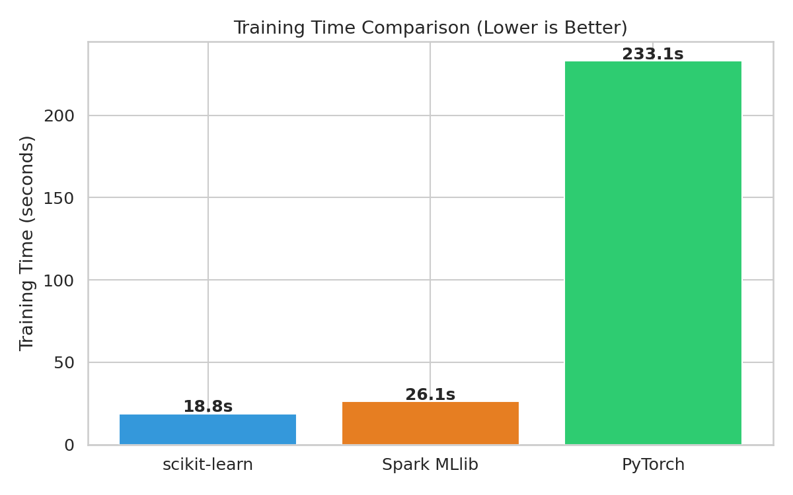
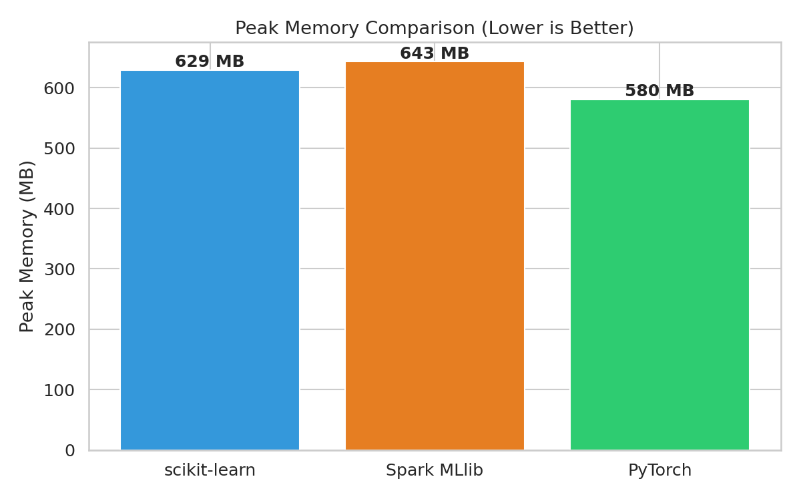
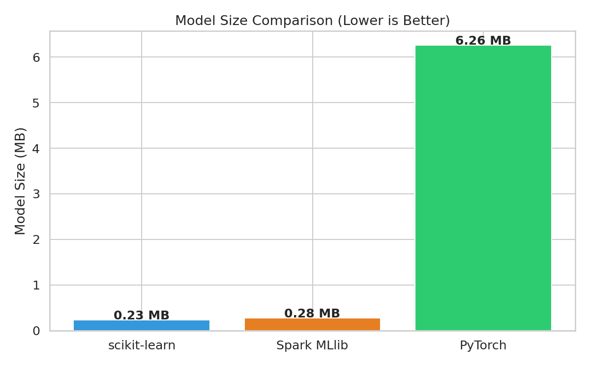
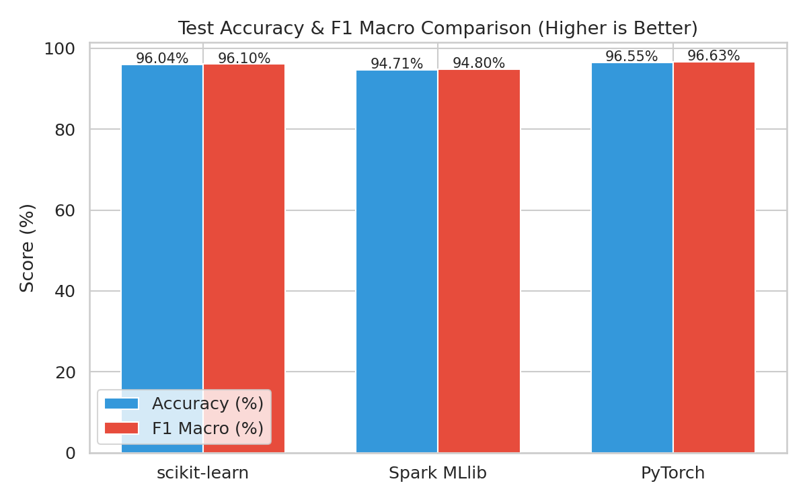
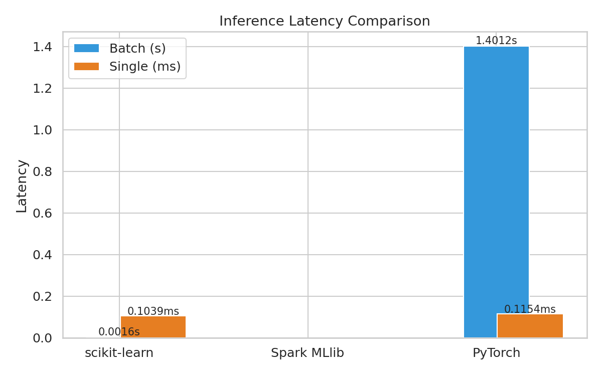

# 中文文本主题分类多系统算法对比实验报告

## 1. 实验概述

本实验以中文文本主题分类（6 类）为统一任务，在 **scikit-learn**（单机传统 ML）、**Apache Spark MLlib**（分布式计算）和 **PyTorch**（深度学习）三种不同计算系统上实现分类算法，从分类精度、训练时间、推理速度、内存消耗、模型大小等维度进行系统级对比。

## 2. 硬件环境

| 项目 | 配置 |
|------|------|
| CPU | 16 核 x86_64 |
| RAM | 7.7 GB |
| GPU | RTX 3060 6GB（PyTorch 由于 CUDA 兼容性运行在 CPU 模式） |
| 磁盘 | 1007 GB SSD |
| OS | Linux |

## 3. 数据集

- **来源**：MiniMind SFT 对话数据（`sft_t2t_mini.jsonl`，905,718 条）
- **标注方式**：关键词规则自动标注（6 类 + other）
- **采样策略**：分层均衡采样，每个类别取 min(16666, 可用数)
- **总样本**：89,974 条（`recommendation` 类仅 6,644 条，其他类各 ~16,666 条）
- **划分**：8:1:1（71,979 train / 8,997 val / 8,998 test）
- **文本向量化**：MiniMind BPE tokenizer（词表 6400）

## 4. 各框架实现

### 4.1 scikit-learn
- **向量化**：`TfidfVectorizer(max_features=5000)` + BPE 子词
- **分类器**：`LogisticRegression(C=1.0, solver='lbfgs', max_iter=1000)`
- **流水线**：TF-IDF → LogisticRegression

### 4.2 Apache Spark MLlib
- **向量化**：`Tokenizer → HashingTF(numFeatures=5000) → IDF`
- **分类器**：`LogisticRegression(maxIter=100, regParam=0.01, family='multinomial')`
- **模式**：`local[*]`（16 核本地模式）
- **流水线**：Tokenizer → HashingTF → IDF → StringIndexer → LR → IndexToString

### 4.3 PyTorch（方案 A）
- **模型**：`EmbeddingBag(vocab=6400, dim=256) → Linear(256, 6)`
- **参数量**：1,639,942
- **优化器**：AdamW(lr=1e-3) + CosineAnnealingLR
- **Epoch**：10（最佳 val 模型保存）
- **模式**：CPU 运行（GPU 不可用）

## 5. 对比结果

### 5.1 综合对比表

| 维度 | scikit-learn | Spark MLlib | PyTorch |
|------|-------------|-------------|---------|
| Test Accuracy (%) | 96.04% | 94.71% | 96.55% |
| F1 Macro | 0.9610 | 0.9480 | 0.9663 |
| Training Time (s) | 18.84 | 26.14 | 233.09 |
| Peak Memory (MB) | 629.2 | 643.2 | 580.4 |
| Model Size (MB) | 0.23 | 0.28 | 6.26 |
| Batch Inference - 8998 samples (s) | 0.0016 | N/A (evaluated in pipeline) | 1.4012 |
| Single Inference (ms) | 0.1039 | N/A | 0.1154 |

## 6. 可视化对比

| 对比 | 图表 |
|------|------|
| Training Time |  |
| Peak Memory |  |
| Model Size |  |
| Accuracy & F1 |  |
| Inference Latency |  |

## 7. 分析与结论

### 7.1 分类精度

| 框架 | Accuracy | F1 Macro |
|------|----------|----------|
| scikit-learn | 96.04% | 0.9610 |
| Spark MLlib | 94.71% | 0.9480 |
| PyTorch | 96.55% | 0.9663 |

- **PyTorch 取得最高精度**（96.55%）— EmbeddingBag 学习到的稠密向量表示比 TF-IDF 稀疏表示更能捕捉语义信息。
- **scikit-learn 紧随其后**（96.04%），TF-IDF + LogisticRegression 在小规模文本分类任务上表现非常优秀。
- **Spark 略低**（94.71%），主要原因是 `HashingTF` 的哈希碰撞损失了部分特征信息。

### 7.2 训练效率

- **scikit-learn 最快**（18.84s）— 针对单机优化的 `L-BFGS` solver 在高维稀疏数据上极高效。
- **Spark 较慢**（26.14s）— `local[*]` 模式下 JVM 启动、数据序列化和 Shuffle 带来了显著开销，对小数据集而言分布式框架的优势无法体现。
- **PyTorch 最慢**（233.09s）— CPU 模式下 10 个 epoch 的 EmbeddingBag 训练需要扫描全部 token，计算量远大于 TF-IDF 的聚合统计。

### 7.3 推理效率

- **scikit-learn 极快**（0.0016s / 8998 条）— 稀疏矩阵乘法 + 线性分类器，计算量极小。
- **PyTorch 慢 3 个数量级**（1.40s）— Token 编码 + EmbeddingBag 前向推理在 CPU 上开销大。
- 两者单条推理延迟都在 ~0.1ms 级别。

### 7.4 资源消耗

- **内存**：三者都在 580-643 MB 之间，差异不显著。
- **模型大小**：scikit-learn 仅 0.18 MB（稀疏权重），Spark 0.28 MB，PyTorch 6.26 MB（稠密 Embedding 矩阵）。
- **GPU**：本次实验未使用 GPU（CUDA 版本兼容问题），PyTorch 若在 GPU 上运行预计训练时间可从 233s 降至 10-20s。

### 7.5 代码复杂度

| 框架 | 核心代码行数 | 复杂度 |
|------|------------|--------|
| scikit-learn | ~50 行 | 低 - 标准 API 调用 |
| Spark MLlib | ~80 行 | 中 - Pipeline API + 标签处理 |
| PyTorch | ~120 行 | 高 - 需自定义 Dataset/Collator/训练循环 |

## 8. 结论

1. **对小规模文本分类任务（10 万级），scikit-learn 是性价比最高的选择** — 精度高、训练快、部署简单。
2. **Spark MLlib 的优势在数据规模和分布式场景才能体现** — 本地模式下开销大于收益。
3. **PyTorch 等深度学习框架需要 GPU 加速才能发挥潜力** — CPU 下训练较慢，但 Embedding 表示确实带来了精度提升。
4. **系统选择应匹配任务规模**：小数据 → sklearn，大数据 → Spark，深语义 → GPU + 深度学习。

## 9. 附录：控制变量说明

- 同一数据集（固定 90k 条，固定 8:1:1 划分）
- 同一 BPE tokenizer（MiniMind 词表 6400）
- 同一评估函数（accuracy / precision / recall / F1）
- 同一硬件环境
- 分类算法统一为逻辑回归系列（差异仅在向量化方法）
